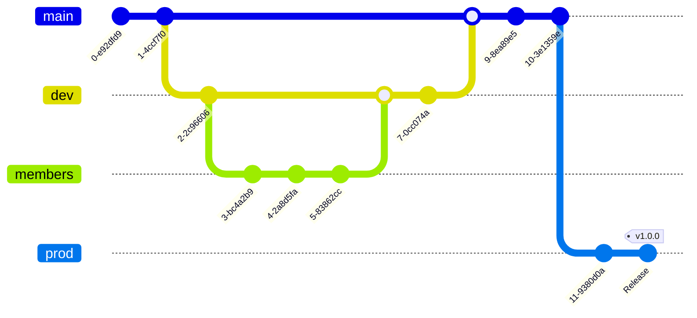

# Selendra

An interoperable nominated Proof-of-Stake network for developing and running Substrate-based and EVM compatible blockchain applications.

Read more at [selendra.org](https://selendra.org)

## Mission

Our mission is to bring blockchain benefits a step closer to the ordinary people who had been overlooked and underserved, and to accelerate the advancement and strengthening the industry as a whole.

## Acknowledgement

Selendra project is inspired by the excellent work of many growing projects in the Polkadot ecosystem and many other blockchain developers around the world. Our progress in the past, the present and the future is only possible thanks to the open sources software community, framework, and tools. Thank you!

This is a work in progress, we will update more information as we progress further. Please refer to the token economy working paper for more details.

# Branches Strategy

Inspired by `Brave Branch Strategy` 
```
prod => releases to production
master || main => releases to staging
dev => releases to development
```

Below is how we work with Branches.



1. production releases should only be made after have been able to test exactly what we're going to release on stage. So these should always be a PR from `master` to `prod` that's basically `"make production === stage"`. These are the only PRs that should go to `prod`.

2. therefore a merge to `master` should only happen when we think the feature is ready to release.

3. when starting a piece of work, create a branch off `master` and keep adding commits there until it's ready to release.

4. to test the code in a real environment, either: 
- a. merge that branch to dev - but don't delete the feature branch. Repeatedly merge the feature that feature branch to dev as work progresses. Merges to dev do not require PRs. OR 
- b. manually initiate the `"Deploy to Development"` github action selecting that branch - this will deploy just those changes to development.

5. In-development QA of this feature should happen on the development environment.

6. when it's good to go merge the feature branch to `master` - with a PR and security review if required. 

7. Do not merge until all reviews are completed.
then, after checking on the staging environment (including QA regression testing if needed) PR a production release as per step 1.

8. now and again we will reset dev to match `master` just to keep the history tidy.
