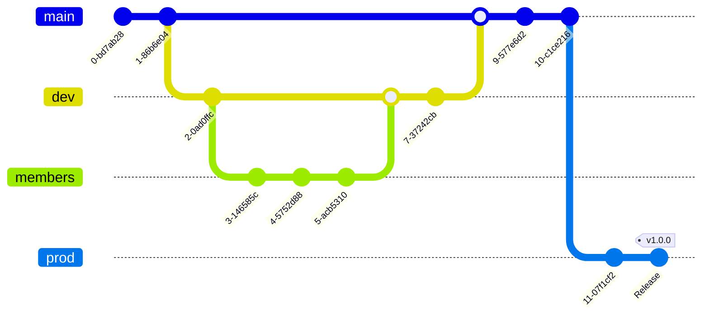

# Selendra

An interoperable nominated Proof-of-Stake network for developing and running Substrate-based and EVM compatible blockchain applications.

## Mission

Our mission is to bring blockchain benefits a step closer to the ordinary people who had been overlooked and underserved, and to accelerate the advancement and strengthening the industry as a whole.

## Acknowledgement

Selendra project is inspired by the excellent work of many growing projects in the Polkadot ecosystem and many other blockchain developers around the world. Our progress in the past, the present and the future is only possible thanks to the open sources software community, framework, and tools. Thank you!

This is a work in progress, we will update more information as we progress further. Please refer to the token economy working paper for more details. 

# Branch Strategy 

Below is how we work with Branches.  

