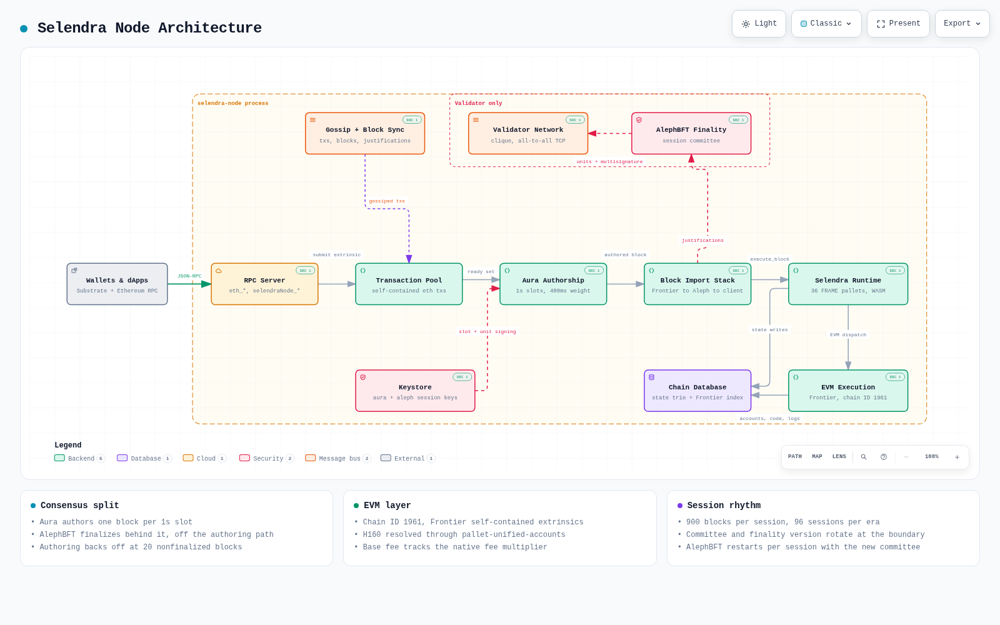

# Selendra Architecture

Derived from the source tree at `spec_version` 20016.
Every number and type name below is quoted from code, with the file it comes from.



Open [`diagrams/selendra-architecture.html`](diagrams/selendra-architecture.html) for the interactive version, where every box links to the source file it was read from.
The diagram is generated from [`diagrams/selendra-architecture.json`](diagrams/selendra-architecture.json); regenerate it with `archify deliver architecture` after editing that spec.

## Contents

1. [Shape of the repository](#shape-of-the-repository)
2. [Chain parameters](#chain-parameters)
3. [The node](#the-node)
4. [Consensus](#consensus)
5. [Networking](#networking)
6. [The runtime](#the-runtime)
7. [EVM layer](#evm-layer)
8. [In-repo pallets](#in-repo-pallets)
9. [Economics](#economics)
10. [Governance and emergency controls](#governance-and-emergency-controls)
11. [Lifecycles](#lifecycles)
12. [Genesis and bootstrapping](#genesis-and-bootstrapping)
13. [Runtime APIs and RPC](#runtime-apis-and-rpc)
14. [Observations from the source](#observations-from-the-source)

## Shape of the repository

A Cargo workspace with four groups of members, plus a vendored `polkadot-sdk` that is excluded from the workspace and consumed as a path dependency.

| Path | What lives there |
|---|---|
| `bin/node` | The `selendra-node` binary: service wiring, CLI, RPC, Frontier plumbing |
| `bin/runtime` | The FRAME runtime compiled to WASM |
| `bin/chain-bootstrapper` | Genesis and keystore generation, chain-spec conversion |
| `bin/client-runtime-api` | A "fake" runtime API impl so the client can be built without linking the real runtime |
| `crate/finality-aleph` | AlephBFT integration: sessions, block sync, justifications, validator network |
| `crate/clique` | Direct all-to-all validator network, separate from the Substrate gossip network |
| `crate/aggregator` | Reliable multicast signature aggregation for justifications |
| `crate/rate-limiter` | Token-bucket rate limiting shared by both networks |
| `crate/frontier` | Vendored Frontier (EVM) stack |
| `pallets/*` | Nine in-repo pallets, listed in [In-repo pallets](#in-repo-pallets) |
| `primitives` | Shared types and constants used by both client and runtime |

`crate/selendra-client`, `crate/finalizer`, `crate/fork-off` and `crate/unified-accounts-cli` are workspace-excluded tools built separately.

## Chain parameters

From `primitives/src/lib.rs` unless noted.

| Parameter | Value | Note |
|---|---|---|
| Block time | 1000 ms | `MILLISECS_PER_BLOCK`, also the Aura slot duration |
| Max block size | 5 MiB | `MAX_BLOCK_SIZE` |
| Max block weight | 400 ms of ref time | `bin/runtime/src/lib.rs`, 400 ms create + 200 ms propagate + 400 ms validate |
| Normal dispatch ratio | 90% | remainder reserved for operational extrinsics |
| Session period | 900 blocks (15 min) | 30 blocks under the `short_session` feature |
| Sessions per era | 96 | so an era is 24 h |
| Score submission period | 300 blocks | 15 under `short_session` |
| Token decimals | 18 | `TOKEN = 10^18` |
| SS58 prefix | 42 | `ADDRESSES_ENCODING` |
| EVM chain ID | 1961 | `bin/runtime/src/evm/mod.rs` |
| Existential deposit | 500 pico-SEL | `bin/runtime/src/lib.rs` |
| Max nonfinalized blocks | 20 | node stops authoring past this gap |

Session keys are two: `aura` (sr25519, block production) and `aleph` (ed25519, finality).

## The node

`bin/node/src/service.rs` is the wiring. It builds in two stages.

`new_partial` assembles the client, backend, keystore, transaction pool and import queue.
The block import stack is composed inside-out:

```
Aura import queue
  └─ FrontierBlockImport          (indexes Ethereum tx/log mappings)
      └─ FavouriteMarkerBlockImport (tells the sync select-chain about new favourites)
          └─ AlephBlockImport      (routes justifications to the finality service)
              └─ Client
```

`get_selendra_block_import` returns the inner two layers as one value, which is both a `BlockImport` and a `JustificationImport`.
The Aura import queue takes the Frontier layer as its block import and the Aleph layer separately as its justification import.

`new_authority` then starts everything a validator runs:

- Aura authorship (`sc_consensus_aura::start_aura`), with a `LimitNonfinalized(20)` backoff strategy that stops block production when the chain head runs more than 20 blocks ahead of finality.
- `build_network`, which returns both the Substrate gossip network and the separate validator network handles.
- Frontier background tasks: mapping sync, filter pool expiry, fee-history cache.
- The full RPC server, Substrate plus Ethereum plus the `selendraNode` namespace.
- `run_validator_node`, the AlephBFT party.

Block production and finality are deliberately decoupled: Aura authors on a fixed 1 s slot schedule, AlephBFT finalizes behind it.
A `RedirectingBlockImport` feeds newly authored blocks straight into the finality service without a round trip through the import queue.

Node-specific CLI flags live in `bin/node/src/aleph_cli.rs`:
`--unit-creation-delay` (200 ms), `--validator-port` (30343), `--public-validator-addresses` (required for validators, the node panics without it), `--backup-path` / `--no-backup`, `--alephbft-network-bit-rate` (768 Kib/s), `--substrate-network-bit-rate` (5 Mib/s).

Ethereum flags live in `bin/node/src/eth.rs`, including `--frontier-backend-type` (`key-value` or `sql`), `--max-past-logs`, `--fee-history-limit`, `--execute-gas-limit-multiplier`.

## Consensus

Two mechanisms, running concurrently.

**Aura** picks the author for each 1 s slot from the Aura authority set for the session.
`AllowMultipleBlocksPerSlot` is false, so one block per slot.
Block proposals are given 2/3 of a slot.

**AlephBFT** produces finality. `crate/finality-aleph` wraps the upstream `aleph-bft` crates and adapts them to Substrate.

The module layout follows the data path:

| Module | Responsibility |
|---|---|
| `party` | Runs one AlephBFT instance per session, starting and stopping subtasks at session boundaries |
| `session_map` | Tracks which authorities are in which session, read ahead of time from the runtime |
| `abft` | Adapters over `aleph-bft`, with `current` and `legacy` protocol versions side by side |
| `data_io` | Turns the chain into AlephBFT input and ordered output back into finalization decisions |
| `aggregation` | Collects the multisignature over a finalized hash via reliable multicast |
| `justification` | Encodes, verifies and translates justifications, including a legacy format |
| `finalization` | Applies a verified justification to the Substrate backend |
| `sync` | Selendra's own block and justification sync, replacing the Substrate sync |
| `network` | Session-scoped authentication and message routing over two transports |
| `import` | The block import layers described above |
| `metrics` | Timing, SLO and ABFT-score metrics |

The unit of consensus data is `AlephData`, holding an `UnvalidatedAlephProposal`: a branch of at most `MAX_DATA_BRANCH_LEN = 7` headers above the last finalized block.
The `DataStore` holds proposals back until the blocks they reference are available locally, and asks the sync service for missing ones.
`OrderedDataInterpreter` consumes AlephBFT's ordered output and decides which block becomes the new finalized head.
`aggregator` then collects signatures from the finality committee into a `SignatureSet`, producing an `AlephJustification`.

Protocol versioning is explicit. `VersionedEitherMessage` prefixes every network message with a version, so a `LEGACY_VERSION` and a `CURRENT_VERSION` protocol can coexist while a version change scheduled through `pallet-aleph` takes effect at a session boundary.

Crash recovery uses AlephBFT backups written under `backup-stash` in the base path.
Without them a node that crashes mid-session cannot rejoin until the next session, and risks auto-forking.

## Networking

Two independent networks.

**Substrate gossip** carries transactions and the block sync protocol.
Selendra does not use the stock Substrate sync; `crate/finality-aleph/src/sync` implements its own forest-based block and justification sync on top of a custom notification protocol, with `MAX_MESSAGE_SIZE` limits and a task queue for request scheduling.

**The validator network** (`crate/clique`) maintains direct authenticated connections between all committee members, over TCP, keyed by the `alp0` key type in the keystore.
Validators announce reachable addresses with `--public-validator-addresses`.
Peers are identified by `AuthorityId`, connections are authenticated with the validator's own key rather than a libp2p identity, and `network/session` scopes connectivity to the current session's committee.

Both transports pass through `crate/rate-limiter`, a hierarchical token bucket with per-connection and shared limits, configured by the two bit-rate flags.

`ValidatorAddressCache` records observed validator addressing information for the `selendraNode_unstable_validatorNetworkInfo` RPC, enabled by default since the cost is negligible.

## The runtime

`construct_runtime!` in `bin/runtime/src/lib.rs`, with explicit pallet indices grouped by purpose.

| Index | Pallet | Group |
|---|---|---|
| 0-6 | System, Aura, Aleph, Timestamp, Balances, TransactionPayment, Scheduler | Core |
| 10-18 | Authorship, Staking, Historical, Session, Elections, CommitteeManagement, Treasury, NominationPools | Staking and validators |
| 30-34 | Council, TechnicalCommittee, Democracy, CouncilElections, Preimage | Governance |
| 50-59 | Utility, Multisig, Identity, Vesting, Proxy | Account utilities |
| 80-89 | Ethereum, EVM, DynamicEvmBaseFee, UnifiedAccounts, EthereumChecked, Xvm | EVM |
| 90 | Contracts | WASM contracts |
| 100-101 | SafeMode, TxPause | Emergency controls |
| 155, 200 | Operations, Sudo | Maintenance |

The extrinsic type is Frontier's `fp_self_contained::UncheckedExtrinsic`, which is what lets an unsigned Ethereum transaction validate itself against its own ECDSA signature instead of a Substrate signature.

Signed extensions are the standard set: `CheckNonZeroSender`, `CheckSpecVersion`, `CheckTxVersion`, `CheckGenesis`, `CheckEra`, `CheckNonce`, `CheckWeight`, `ChargeTransactionPayment`.

Validator selection runs through a chain of in-repo pallets rather than the usual `pallet-election-provider-multi-phase`:

```
pallet-staking  (bonds, nominations, rewards, slashing)
   │  ElectionProvider = Elections
   ▼
pallet-elections  (reserved + non-reserved seats, permissioned or permissionless)
   │  BannedValidators = CommitteeManagement
   ▼
pallet-committee-management  (per-session committee, performance tracking, bans)
   │  FinalityCommitteeManager = Aleph
   ▼
pallet-aleph  (finality committee, finality version, ABFT scores)
   │  SessionManager for pallet-session
   ▼
pallet-session  →  (Aura, Aleph) session handlers
```

`SessionAndEraManager` in `pallet-committee-management` is the adapter that drives era rotation for staking and session rotation for the committee off the same hooks.

Staking is DPoS, not NPoS: `NominationsQuota = FixedNominationsQuota<1>`, so a nominator backs exactly one validator.
The source carries an explicit warning not to change this.

## EVM layer

`bin/runtime/src/evm/mod.rs`, on top of the vendored Frontier in `crate/frontier`.

**Address mapping.** `pallet_evm::Config::AddressMapping = UnifiedAccounts`, so an EVM call resolves an H160 to a real `AccountId` through the unified-accounts map, falling back to `HashedDefaultMappings<BlakeTwo256>` when no explicit claim exists.
An account holder proves control of an EVM key by signing an EIP-712 payload whose domain separator binds the name `Selendra EVM Claim`, the chain ID and the genesis block hash, then calls `claim_evm_address`.
The map is bidirectional and one-to-one, with a 0.01 SEL storage fee.
Remapping an already-claimed pair is governance-gated: `RemapOrigin` is Root or a 3/5 Council majority, and `request_remap` only executes after `RemapDelay = 7 days`, which gives the owner time to `cancel_remap`.

**Gas and fees.** `WeightPerGas` is derived from `GAS_PER_SECOND = 40_000_000`.
`FeeCalculator = DynamicEvmBaseFee`, whose `on_finalize` recomputes the base fee each block:

```
ideal = min(AdjustmentFactor, MaxAdjustmentFactor) * WeightFactor * 25 / 98974
new   = clamp(ideal, old ± StepLimitRatio * old, [MinBaseFeePerGas, MaxBaseFeePerGas])
```

`AdjustmentFactor` reads `pallet_transaction_payment::NextFeeMultiplier`, tying EVM gas price to native fee pressure.
`MaxAdjustmentFactor = 10` exists because this runtime sets `MaximumMultiplier = Bounded::max_value()`, leaving the multiplier otherwise unbounded.
`StepLimitRatio` is 93/1,000,000 per block, roughly 0.0093%, which bounds how fast the price can move.
Configured bounds are 0.1 to 10,000 Gwei with a 10 Gwei default, and the pallet skips the bounds entirely while the stored value is outside them, so a live chain converges into range rather than jumping.

**Precompiles.** Seven, in `bin/runtime/src/evm/precompiles.rs`: the five Ethereum standard ones (ecrecover, sha256, ripemd160, identity, modexp) plus `Sha3FIPS256` at 1024 and `ECRecoverPublicKey` at 1025.
There is no precompile bridging EVM contracts to Substrate pallets.

**Cross-VM calls.** `pallet-xvm` routes a call from one VM to the other, using `pallet-ethereum-checked` to execute an EVM transaction that has no ECDSA signature, on behalf of a Substrate origin.
This is what lets a WASM contract or a pallet call into an EVM contract.
`CheckedTxWeightLimit` is `u64::MAX / 2`, `XvmTxWeightLimit` is `u64::MAX / 4`.

**Block author.** `FindAuthorTruncated<Aura>` reports the Aura authority's first 20 bytes as the Ethereum `coinbase`.

**Indexing.** The Frontier backend is either the key-value store inherited from the node database or a SQLite database with custom log indexing, selected at startup.

## In-repo pallets

| Pallet | Purpose | Extrinsics |
|---|---|---|
| `aleph` | Finality authorities, finality version scheduling, emergency finalizer, ABFT scores, inflation parameters | `set_emergency_finalizer`, `schedule_finality_version_change`, `set_inflation_parameters`, `submit_abft_score`, `unsigned_submit_abft_score` |
| `elections` | Reserved and non-reserved validator seats, election openness | `change_validators`, `set_elections_openness` |
| `committee-management` | Per-session committee, block production and finality performance tracking, bans | `set_ban_config`, `ban_from_committee`, `cancel_ban`, `set_lenient_threshold`, `set_finality_ban_config` |
| `unified-accounts` | Native to EVM account mapping | `claim_evm_address`, `claim_default_evm_address`, `request_remap`, `execute_remap`, `cancel_remap` |
| `dynamic-evm-base-fee` | EVM base fee tracking native fee pressure | `set_base_fee_per_gas` |
| `ethereum-checked` | EVM execution for origins without an ECDSA signature | `transact` |
| `xvm` | Cross-VM call routing | none, called by other pallets |
| `operations` | Storage repair | `fix_accounts_consumers_counter` |
| `aleph-runtime-api` | Runtime API definitions consumed by `finality-aleph` | not a FRAME pallet |

`pallet-aleph` also carries the two inflation storage values (`SelCap`, `ExponentialInflationHorizon`) that the staking payout formula reads, and validates the bounds on any change to them.

Committee bans have two independent tracks.
Production bans key off `SessionValidatorBlockCount` against a lenient threshold (default 90% of the expected share).
Finality bans key off ABFT scores submitted by validators through `pallet-aleph`, with `DEFAULT_FINALITY_BAN_SESSION_COUNT_THRESHOLD` set to `SessionCount::MAX`, meaning finality banning is effectively off by default.

## Economics

**Inflation** is exponential decay toward a cap, in `ExponentialEraPayout`:

```
payout = (1 - exp(-era_duration / horizon)) * (SelCap - total_issuance)
```

`SelCap` defaults to 320,000,000 SEL and `ExponentialInflationHorizon` to 154,283,512,497 ms (about 4.9 years).
Issuance approaches the cap and never reaches it.
Of each era payout, 75% goes to validators and 25% to `RewardRemainder`, which is the Treasury.

**Transaction fees** use a two-part model.
`WeightToFee` is linear with `WeightFeeFactor = 585_500_000_000_000` (about 0.0005 SEL per unit of ref time), and length fee is a flat `10_000_000_000_000` per byte.
`TargetedFeeAdjustment` moves the multiplier toward 50% block saturation, with variability 0.067 and a floor of 1.
Of every fee, 80% is burned and 20% goes to the block author; tips go entirely to the author.

**Staking bonds:** 25,000 SEL minimum validator bond, 100 SEL minimum nominator bond, 14-era bonding duration (14 days), 13-era slash defer, 84-era history depth, up to 1024 nominators rewarded per validator.

**Slashes and rejected deposits** all route to the Treasury: staking slashes, democracy slashes, identity slashes, Phragmen loser and kicked-member deposits.

**Treasury spending** is proposal-driven with a 0% burn.
Without the `enable_treasury_proposals` feature, `TREASURY_PROPOSAL_BOND` is 100 billion SEL, which disables proposals in practice.
`SpendOrigin` is `NeverEnsureOrigin`, so the newer direct-spend path is closed too.

## Governance and emergency controls

Three bodies.

**Council**, 13 seats, elected by Phragmen (`pallet_elections_phragmen`) with a 1000 SEL candidacy bond and a 7-day term, 7 runners-up.
A 3/5 Council majority is the standard admin origin across the runtime: `pallet-aleph`, `pallet-elections`, `pallet-committee-management`, staking, treasury rejection, identity, scheduler, preimage, unified-accounts remapping.

**Technical Committee**, 7 seats, appointed by Council.
It holds the fast-track (3/5) and instant-enact (unanimous) origins, and any single member can veto an external proposal.

**Democracy**, public referenda with a 7-day launch period, 7-day voting period, 1-day enactment, 7-day cooloff, and a 100 SEL minimum deposit.
Fast-tracked referenda vote for 3 hours.

**Sudo is still present** at index 200.

Two emergency levers:

`pallet-safe-mode` can only be entered by Root (permissionless entry is disabled by setting the deposit to `None` and duration to 0).
It lasts one session per activation and whitelists only Sudo, System, SafeMode and Timestamp calls.

`pallet-tx-pause` lets Root or a 2/3 Council majority pause individual calls by name, with Sudo, System and Timestamp permanently exempt.

`pallet-aleph` additionally holds an emergency finalizer: a single authority key, set by admin origin, whose signature alone finalizes a block.
The node exposes this through the `selendraNode_emergencyFinalize` RPC.

Contracts are permissionless to upload and instantiate (`UploadOrigin` and `InstantiateOrigin` are `EnsureSigned`), with a 256 KiB code limit and a 16-frame call stack.
Contract randomness is deliberately dead: `DummyDeprecatedRandomness` returns zeros, so any code using it cannot be uploaded meaningfully.

## Lifecycles

**A native transaction.** Submitted to the pool, validated through the signed extensions, included by the Aura author within a 400 ms weight budget, fee charged by `ChargeTransactionPayment` and split 80/20 burn/author.

**An Ethereum transaction.** Arrives over `eth_sendRawTransaction`, converted by `TransactionConverter` into a self-contained `pallet_ethereum::transact` extrinsic, validated against its own ECDSA signature, executed by `pallet_evm::runner::stack::Runner` with the sender's H160 resolved through `UnifiedAccounts`, and its receipt and logs indexed into the Frontier backend on import.

**A block.** Aura author proposes at its slot, block goes through the import stack (Aleph justification routing, favourite marking, Frontier indexing), `DynamicEvmBaseFee::on_finalize` adjusts the EVM base fee, `pallet-committee-management` records the author for performance tracking.
The block is not final at this point.

**Finality.** The AlephBFT party for the current session proposes a branch of up to 7 headers, the network orders it, `OrderedDataInterpreter` picks the new finalized head, `aggregator` collects the committee's multisignature into an `AlephJustification`, and `AlephFinalizer` applies it to the backend.
The justification propagates to non-committee nodes through the sync service.

**A session** is 900 blocks.
At the boundary, `pallet-session` rotates keys, `pallet-elections` supplies the validator set, `pallet-committee-management` chooses the producers and finalizers for the session and evaluates the previous session's performance, and the AlephBFT party stops the old instance and starts a new one with the new committee.
Any scheduled finality version change also takes effect here.

**An era** is 96 sessions, 24 hours.
Era rotation triggers the staking payout computed by `ExponentialEraPayout`, applies deferred slashes from 13 eras earlier, and refreshes the era validator set.

## Genesis and bootstrapping

`bin/chain-bootstrapper` generates a chain spec and the keystores together.
`bootstrap-chain` takes account IDs and authority account IDs, creates each node's Aura and Aleph session keys plus its p2p secret under `base_path/<account_id>/`, and emits a chain spec on stdout, raw or human-readable.
`convert-chainspec-to-raw` converts an existing spec.

`bin/client-runtime-api` exists so the node can be compiled against runtime API *signatures* without linking the real runtime.
It provides a `fake_runtime` type implementing every API with `unimplemented!()` bodies, used purely as a type parameter to `TFullClient`.
The real implementations come from the WASM blob at runtime.

## Runtime APIs and RPC

Standard Substrate APIs (`Core`, `Metadata`, `BlockBuilder`, `TaggedTransactionQueue`, `OffchainWorkerApi`, `SessionKeys`, `AuraApi`, `GenesisBuilder`) plus two families.

`AlephSessionApi` serves the client's consensus needs: `authorities`, `next_session_authorities`, `authority_data`, `session_period`, `millisecs_per_block`, `finality_version`, `next_session_finality_version`, `predict_session_committee`, `next_session_aura_authorities`, `key_owner`, `yearly_inflation`, `current_era_payout`, `submit_abft_score`, `score_submission_period`.

`fp_rpc::EthereumRuntimeRPCApi` and `ConvertTransactionRuntimeApi` back the Ethereum JSON-RPC surface.

The RPC server merges three sets:

- Substrate: System, TransactionPayment, plus the standard set from `spawn_tasks`.
- Ethereum: `Eth`, `EthFilter`, `EthPubSub`, `Net`, `Debug`, with an optional dev signer. `Web3` is not merged in.
- `selendraNode` namespace (`bin/node/src/rpc/selendra_node_rpc.rs`): `emergencyFinalize`, `getBlockAuthor`, `ready`, `unstable_validatorNetworkInfo`.

## Observations from the source

Facts worth knowing before changing this code.
None of these are speculation; each is visible at the cited line.

`bin/runtime/src/evm/mod.rs:161` sets `type WeightFactor = ()`, and `impl Get<u128> for ()` yields 0.
The base fee formula multiplies by that factor, so `ideal_new_bfpg` is always 0 and the clamp drives the EVM base fee to `MinBaseFeePerGas` (0.1 Gwei) every block regardless of load.
The pallet's own mock uses `30_000_000_000_000_000`.
The dynamic fee mechanism is therefore configured but inert.

`BlockGasLimit` in the same file is `NORMAL_DISPATCH_RATIO * WEIGHT_REF_TIME_PER_SECOND / WEIGHT_PER_GAS`, or 36,000,000 gas, derived from a full second of ref time.
`MAX_BLOCK_WEIGHT` is 400 ms.
The advertised gas limit is roughly 2.25x what a block's weight budget can actually execute.

Treasury proposals are disabled by default, and `SpendOrigin` is `NeverEnsureOrigin`, so the treasury accumulates (slashes, 25% of era payout, rejected deposits) with no enabled spending path short of a runtime upgrade or Sudo.

Sudo is present in a runtime that also has Council, Technical Committee and Democracy.

`pallet_evm::Config::OnChargeTransaction = ()`, so EVM fees do not flow through the same 80/20 burn-and-author split as native fees.

`MaxAuthorities` is 100,000 while `MaxValidators` and `MaxCommitteeSize` are 1,000.

Finality-based banning is off by default: `DEFAULT_FINALITY_BAN_SESSION_COUNT_THRESHOLD` is `SessionCount::MAX`.

`pallet_transaction_payment::MaximumMultiplier` is `Bounded::max_value()`, so native fee pressure has no ceiling; the EVM side compensates with `MaxAdjustmentFactor`, the native side does not.
