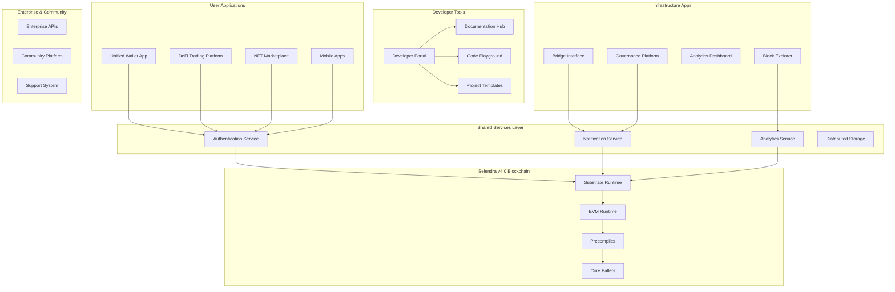

# Design Document

## Overview

The Selendra Ecosystem Apps represent a comprehensive suite of applications designed to provide users and developers with seamless access to Selendra's blockchain capabilities. The design emphasizes **User Experience First**, **Developer Empowerment**, and **Community Growth** as core principles.

This ecosystem leverages Selendra v4.0's unique features - unified accounts, EVM precompiles, native DeFi infrastructure, and cross-chain capabilities - to create applications that are not just functional, but delightful to use and competitive with the best Web3 applications available today.

## Architecture

### High-Level Ecosystem Architecture



### Technology Stack

#### Frontend Applications
- **Framework**: React 18+ with Next.js for SSR/SSG
- **State Management**: Zustand for lightweight state management
- **UI Components**: Custom design system built on Tailwind CSS
- **Web3 Integration**: Selendra TypeScript SDK + ethers.js for EVM
- **Mobile**: React Native with Expo for cross-platform development

#### Backend Services
- **API Layer**: Node.js with Express/Fastify for REST APIs
- **Real-time**: WebSocket connections for live updates
- **Database**: PostgreSQL for relational data, Redis for caching
- **Authentication**: JWT with refresh tokens, Web3 signature verification
- **File Storage**: IPFS for decentralized storage, AWS S3 for backups

#### Infrastructure
- **Deployment**: Docker containers with Kubernetes orchestration
- **CDN**: CloudFlare for global content delivery
- **Monitoring**: Prometheus + Grafana for metrics and alerting
- **CI/CD**: GitHub Actions with automated testing and deployment

## Components and Interfaces

### 1. Unified Wallet Application

#### Core Architecture
```typescript
// Wallet state management
interface WalletState {
    accounts: {
        native: SubstrateAccount[];
        evm: EVMAccount[];
        unified: UnifiedAccount[];
    };
    balances: TokenBalance[];
    transactions: Transaction[];
    socialRecovery: RecoveryConfig;
    sessionKeys: SessionKey[];
}

// Account management service
class AccountManager {
    async createUnifiedAccount(): Promise<UnifiedAccount>;
    async linkAccounts(native: SubstrateAccount, evm: EVMAccount): Promise<void>;
    async setupSocialRecovery(guardians: Guardian[], threshold: number): Promise<void>;
    async createSessionKey(permissions: Permission[], duration: number): Promise<SessionKey>;
}
```

#### Key Features
- **Unified Account Creation**: Single-click creation of linked native and EVM accounts
- **Social Recovery**: Guardian-based account recovery with configurable thresholds
- **Session Keys**: Time-limited permissions for seamless dApp interactions
- **Multi-Chain Support**: Native support for Ethereum and other bridged chains
- **Hardware Wallet Integration**: Ledger and Trezor support for enhanced security

#### User Interface Design
```typescript
// Main wallet interface components
interface WalletComponents {
    AccountOverview: React.FC<{account: UnifiedAccount}>;
    AssetList: React.FC<{balances: TokenBalance[]}>;
    TransactionHistory: React.FC<{transactions: Transaction[]}>;
    SecuritySettings: React.FC<{recovery: RecoveryConfig}>;
    DAppConnector: React.FC<{sessionKeys: SessionKey[]}>;
    BridgeInterface: React.FC<{supportedChains: Chain[]}>;
}
```

### 2. DeFi Trading Platform

#### Trading Engine Architecture
```typescript
// DeFi platform core services
class DeFiPlatform {
    public dex: DEXService;
    public staking: StakingService;
    public lending: LendingService;
    public analytics: AnalyticsService;
    
    constructor(sdk: SelendraSDK) {
        this.dex = new DEXService(sdk);
        this.staking = new StakingService(sdk);
        this.lending = new LendingService(sdk);
        this.analytics = new AnalyticsService(sdk);
    }
}

// DEX service for trading operations
class DEXService {
    async getPoolInfo(tokenA: AssetId, tokenB: AssetId): Promise<PoolInfo>;
    async calculateSwapOutput(amountIn: Balance, path: AssetId[]): Promise<SwapQuote>;
    async executeSwap(quote: SwapQuote, slippage: number): Promise<Transaction>;
    async addLiquidity(tokenA: AssetId, tokenB: AssetId, amounts: [Balance, Balance]): Promise<Transaction>;
    async removeLiquidity(poolId: AssetId, lpTokens: Balance): Promise<Transaction>;
}
```

#### Advanced Trading Features
- **MEV Protection**: Sandwich attack prevention and front-running protection
- **Limit Orders**: Advanced order types with conditional execution
- **Portfolio Analytics**: Real-time P&L tracking and performance metrics
- **Yield Farming**: Automated yield optimization and compound strategies
- **Risk Management**: Impermanent loss calculations and health factor monitoring

#### Real-Time Data Integration
```typescript
// WebSocket service for live market data
class MarketDataService {
    private ws: WebSocket;
    
    subscribeToPrice(assetId: AssetId, callback: (price: PriceUpdate) => void): void;
    subscribeToOrderBook(poolId: AssetId, callback: (orderBook: OrderBook) => void): void;
    subscribeToTrades(poolId: AssetId, callback: (trade: Trade) => void): void;
    
    // Real-time portfolio updates
    subscribeToPortfolio(account: Account, callback: (portfolio: Portfolio) => void): void;
}
```

### 3. Developer Portal and Documentation Hub

#### Documentation System Architecture
```typescript
// Auto-generated documentation system
class DocumentationGenerator {
    async generateFromContract(contractAddress: string): Promise<ContractDocs>;
    async generateFromABI(abi: ABI): Promise<InterfaceDocs>;
    async generateSDKDocs(sdkVersion: string): Promise<SDKDocs>;
    
    // Interactive examples
    async createPlaygroundExample(contract: Contract): Promise<PlaygroundConfig>;
    async generateCodeSamples(operation: Operation, languages: Language[]): Promise<CodeSample[]>;
}

// Developer onboarding system
class OnboardingService {
    async createDeveloperProfile(github: string, skills: Skill[]): Promise<DeveloperProfile>;
    async recommendLearningPath(profile: DeveloperProfile): Promise<LearningPath>;
    async trackProgress(profile: DeveloperProfile, milestone: Milestone): Promise<void>;
}
```

#### Interactive Learning Platform
- **Code Playground**: Browser-based IDE with real-time compilation and deployment
- **Tutorial System**: Step-by-step guides with interactive code examples
- **Project Templates**: Production-ready templates for common use cases
- **Community Q&A**: Stack Overflow-style question and answer system
- **AI Assistant**: GPT-powered coding assistant trained on Selendra documentation

#### Developer Tools Integration
```typescript
// Integrated development environment
interface IDEComponents {
    CodeEditor: React.FC<{language: 'solidity' | 'rust' | 'typescript'}>;
    Compiler: React.FC<{source: string, target: 'wasm' | 'evm'}>;
    Deployer: React.FC<{bytecode: string, network: Network}>;
    Debugger: React.FC<{transaction: Transaction}>;
    TestRunner: React.FC<{tests: Test[]}>;
}
```

### 4. NFT Marketplace and Creator Tools

#### NFT Platform Architecture
```typescript
// NFT marketplace core services
class NFTMarketplace {
    public minting: MintingService;
    public trading: TradingService;
    public metadata: MetadataService;
    public royalties: RoyaltyService;
    
    constructor(sdk: SelendraSDK, ipfs: IPFSService) {
        this.minting = new MintingService(sdk, ipfs);
        this.trading = new TradingService(sdk);
        this.metadata = new MetadataService(ipfs);
        this.royalties = new RoyaltyService(sdk);
    }
}

// Advanced minting capabilities
class MintingService {
    async batchMint(metadata: NFTMetadata[], royalties: RoyaltyConfig): Promise<Transaction>;
    async createCollection(config: CollectionConfig): Promise<Collection>;
    async setupUtilityNFT(nft: NFT, utilities: Utility[]): Promise<Transaction>;
    async enableFractionalOwnership(nft: NFT, shares: number): Promise<Transaction>;
}
```

#### Creator Economy Features
- **No-Code Minting**: Drag-and-drop NFT creation with metadata management
- **Dynamic NFTs**: Time-based and interaction-based NFT evolution
- **Utility Integration**: NFT staking, governance voting, and access control
- **Creator Analytics**: Sales tracking, royalty distribution, and audience insights
- **Cross-Chain NFTs**: Bridge NFTs to Ethereum and other supported networks

#### Marketplace Features
```typescript
// Advanced trading mechanisms
interface TradingFeatures {
    Auctions: {
        english: EnglishAuction;
        dutch: DutchAuction;
        reserve: ReserveAuction;
    };
    
    Offers: {
        collection: CollectionOffer;
        trait: TraitOffer;
        individual: IndividualOffer;
    };
    
    Bundles: {
        create: (nfts: NFT[]) => Bundle;
        trade: (bundle: Bundle) => Transaction;
    };
    
    Fractionalization: {
        split: (nft: NFT, shares: number) => FractionalNFT;
        trade: (shares: FractionalShare[]) => Transaction;
    };
}
```

### 5. Governance and DAO Management Platform

#### Governance Platform Architecture
```typescript
// Governance management system
class GovernancePlatform {
    public proposals: ProposalService;
    public voting: VotingService;
    public treasury: TreasuryService;
    public daos: DAOService;
    
    constructor(sdk: SelendraSDK) {
        this.proposals = new ProposalService(sdk);
        this.voting = new VotingService(sdk);
        this.treasury = new TreasuryService(sdk);
        this.daos = new DAOService(sdk);
    }
}

// DAO creation and management
class DAOService {
    async createDAO(config: DAOConfig): Promise<DAO>;
    async deployGovernanceContract(dao: DAO, rules: GovernanceRules): Promise<Contract>;
    async setupTreasury(dao: DAO, multisig: MultisigConfig): Promise<Treasury>;
    async manageMembers(dao: DAO, members: Member[]): Promise<Transaction>;
}
```

#### Advanced Governance Features
- **Proposal Templates**: Pre-built templates for common governance actions
- **Delegation System**: Liquid democracy with transparent delegation tracking
- **Impact Analysis**: Automated analysis of proposal effects on network/DAO
- **Quadratic Voting**: Advanced voting mechanisms to prevent plutocracy
- **Treasury Management**: Multi-signature controls with spending limits and workflows

#### DAO Analytics Dashboard
```typescript
// Governance analytics and insights
class GovernanceAnalytics {
    async getParticipationMetrics(dao: DAO): Promise<ParticipationMetrics>;
    async getVotingPatterns(timeframe: TimeFrame): Promise<VotingPattern[]>;
    async getTreasuryHealth(dao: DAO): Promise<TreasuryHealth>;
    async getPowerDistribution(dao: DAO): Promise<PowerDistribution>;
    
    // Predictive analytics
    async predictProposalOutcome(proposal: Proposal): Promise<OutcomePrediction>;
    async recommendOptimalTiming(proposal: Proposal): Promise<TimingRecommendation>;
}
```

### 6. Cross-Chain Bridge Interface

#### Bridge Interface Architecture
```typescript
// Cross-chain bridge management
class BridgeInterface {
    public routes: RouteService;
    public security: SecurityService;
    public monitoring: MonitoringService;
    
    constructor(layerZero: LayerZeroSDK, selendra: SelendraSDK) {
        this.routes = new RouteService(layerZero, selendra);
        this.security = new SecurityService();
        this.monitoring = new MonitoringService();
    }
}

// Intelligent route optimization
class RouteService {
    async findOptimalRoute(from: Chain, to: Chain, asset: Asset, amount: Balance): Promise<BridgeRoute>;
    async estimateFees(route: BridgeRoute): Promise<FeeEstimate>;
    async estimateTime(route: BridgeRoute): Promise<TimeEstimate>;
    async checkSecurity(route: BridgeRoute): Promise<SecurityRating>;
}
```

#### User Experience Features
- **Route Optimization**: Automatic selection of cheapest/fastest bridge routes
- **Security Ratings**: Transparent security scores for different bridge options
- **Transaction Tracking**: Real-time status updates across multiple chains
- **Recovery Tools**: Automated recovery for failed or stuck transactions
- **Batch Bridging**: Efficient batching of multiple asset transfers

#### Security and Monitoring
```typescript
// Bridge security and monitoring systems
class BridgeMonitoring {
    async monitorTransactionStatus(txHash: string, chain: Chain): Promise<TransactionStatus>;
    async detectAnomalies(route: BridgeRoute): Promise<Anomaly[]>;
    async validateBridgeHealth(bridge: Bridge): Promise<HealthStatus>;
    
    // Emergency response
    async pauseBridge(bridge: Bridge, reason: string): Promise<void>;
    async initiateFundsRecovery(txHash: string): Promise<RecoveryProcess>;
}
```

## Data Models

### User and Account Models
```typescript
// Unified user account system
interface UnifiedAccount {
    id: string;
    nativeAddress: string;
    evmAddress: string;
    linkedAt: Date;
    socialRecovery: {
        guardians: Guardian[];
        threshold: number;
        recoveryDelay: number;
    };
    sessionKeys: SessionKey[];
    preferences: UserPreferences;
}

interface Guardian {
    address: string;
    name: string;
    addedAt: Date;
    verified: boolean;
}

interface SessionKey {
    publicKey: string;
    permissions: Permission[];
    expiresAt: Date;
    createdAt: Date;
    lastUsed?: Date;
}
```

### DeFi Data Models
```typescript
// Trading and DeFi data structures
interface Portfolio {
    account: string;
    totalValue: Balance;
    assets: AssetHolding[];
    positions: Position[];
    pnl: ProfitLoss;
    riskMetrics: RiskMetrics;
}

interface Position {
    type: 'liquidity' | 'staking' | 'lending' | 'borrowing';
    protocol: string;
    asset: Asset;
    amount: Balance;
    entryPrice: Price;
    currentValue: Balance;
    rewards: Balance;
    apy: number;
}

interface SwapQuote {
    inputAsset: Asset;
    outputAsset: Asset;
    inputAmount: Balance;
    outputAmount: Balance;
    priceImpact: number;
    fees: Fee[];
    route: SwapRoute[];
    slippageTolerance: number;
}
```

### NFT and Marketplace Models
```typescript
// NFT and marketplace data structures
interface NFT {
    id: string;
    contractAddress: string;
    tokenId: string;
    metadata: NFTMetadata;
    owner: string;
    creator: string;
    royalties: RoyaltyConfig;
    utilities: Utility[];
    tradingHistory: Trade[];
}

interface NFTMetadata {
    name: string;
    description: string;
    image: string;
    attributes: Attribute[];
    animation_url?: string;
    external_url?: string;
}

interface MarketplaceListing {
    nft: NFT;
    seller: string;
    price: Price;
    currency: Asset;
    listingType: 'fixed' | 'auction' | 'offer';
    startTime: Date;
    endTime?: Date;
    status: 'active' | 'sold' | 'cancelled' | 'expired';
}
```

### Governance Data Models
```typescript
// Governance and DAO data structures
interface Proposal {
    id: string;
    title: string;
    description: string;
    proposer: string;
    type: 'council' | 'referendum' | 'treasury' | 'dao';
    call: RuntimeCall;
    votingPeriod: {
        start: Date;
        end: Date;
    };
    votes: Vote[];
    status: ProposalStatus;
    impactAnalysis: ImpactAnalysis;
}

interface DAO {
    id: string;
    name: string;
    description: string;
    governanceContract: string;
    treasuryContract: string;
    members: Member[];
    proposals: Proposal[];
    treasury: Treasury;
    rules: GovernanceRules;
}

interface Vote {
    voter: string;
    choice: 'aye' | 'nay' | 'abstain';
    conviction?: number;
    amount?: Balance;
    timestamp: Date;
    delegatedFrom?: string[];
}
```

## Error Handling

### Comprehensive Error Management
```typescript
// Application-level error handling
export class EcosystemError extends Error {
    constructor(
        public code: string,
        message: string,
        public context: ErrorContext,
        public userMessage: string,
        public recoveryActions: RecoveryAction[]
    ) {
        super(message);
    }
    
    toUserNotification(): UserNotification {
        return {
            type: 'error',
            title: 'Something went wrong',
            message: this.userMessage,
            actions: this.recoveryActions.map(action => ({
                label: action.label,
                handler: action.handler
            }))
        };
    }
}

// Error categories and handling
enum ErrorCategory {
    NETWORK = 'network',
    TRANSACTION = 'transaction',
    AUTHENTICATION = 'auth',
    VALIDATION = 'validation',
    BRIDGE = 'bridge',
    CONTRACT = 'contract'
}

interface RecoveryAction {
    label: string;
    handler: () => Promise<void>;
    type: 'retry' | 'redirect' | 'contact_support' | 'manual_fix';
}
```

### User-Friendly Error Messages
```typescript
// Error message localization and user guidance
class ErrorMessageService {
    getLocalizedMessage(error: EcosystemError, locale: string): string;
    getSuggestedActions(error: EcosystemError): RecoveryAction[];
    getHelpArticles(error: EcosystemError): HelpArticle[];
    
    // Contextual help based on user action
    getContextualHelp(action: UserAction, error?: EcosystemError): ContextualHelp;
}

// Proactive error prevention
class ErrorPreventionService {
    validateTransaction(tx: Transaction): ValidationResult;
    checkNetworkConditions(): NetworkHealth;
    predictFailureRisk(operation: Operation): RiskAssessment;
    suggestOptimalTiming(operation: Operation): TimingSuggestion;
}
```

## Testing Strategy

### Multi-Application Testing Framework

#### 1. Component Testing
```typescript
// React component testing with user interactions
describe('WalletComponents', () => {
    it('should create unified account', async () => {
        render(<AccountCreation />);
        
        fireEvent.click(screen.getByText('Create Unified Account'));
        
        await waitFor(() => {
            expect(screen.getByText('Account Created Successfully')).toBeInTheDocument();
        });
        
        // Verify both native and EVM accounts were created
        expect(mockAccountManager.createUnifiedAccount).toHaveBeenCalled();
    });
    
    it('should setup social recovery', async () => {
        const guardians = [mockGuardian1, mockGuardian2, mockGuardian3];
        
        render(<SocialRecoverySetup />);
        
        // Add guardians
        for (const guardian of guardians) {
            fireEvent.click(screen.getByText('Add Guardian'));
            fireEvent.change(screen.getByPlaceholderText('Guardian Address'), {
                target: { value: guardian.address }
            });
            fireEvent.click(screen.getByText('Confirm'));
        }
        
        // Set threshold
        fireEvent.change(screen.getByLabelText('Recovery Threshold'), {
            target: { value: '2' }
        });
        
        fireEvent.click(screen.getByText('Setup Recovery'));
        
        await waitFor(() => {
            expect(mockAccountManager.setupSocialRecovery).toHaveBeenCalledWith(
                guardians,
                2
            );
        });
    });
});
```

#### 2. Integration Testing
```typescript
// End-to-end user workflows
describe('DeFi Platform Integration', () => {
    it('should complete full trading workflow', async () => {
        const { wallet, dexPlatform } = await setupTestEnvironment();
        
        // Connect wallet
        await wallet.connect();
        
        // Get initial balances
        const initialBalance = await wallet.getBalance('SEL');
        
        // Execute swap
        const swapQuote = await dexPlatform.getSwapQuote('SEL', 'USDC', 1000);
        const transaction = await dexPlatform.executeSwap(swapQuote, 0.5); // 0.5% slippage
        
        // Wait for confirmation
        await transaction.wait();
        
        // Verify balance changes
        const finalBalance = await wallet.getBalance('SEL');
        const usdcBalance = await wallet.getBalance('USDC');
        
        expect(finalBalance).toBeLessThan(initialBalance);
        expect(usdcBalance).toBeGreaterThan(0);
    });
    
    it('should handle failed transactions gracefully', async () => {
        const { dexPlatform } = await setupTestEnvironment();
        
        // Attempt swap with insufficient balance
        const swapQuote = await dexPlatform.getSwapQuote('SEL', 'USDC', 999999999);
        
        await expect(dexPlatform.executeSwap(swapQuote, 0.5)).rejects.toThrow(
            'Insufficient balance'
        );
        
        // Verify error handling UI
        expect(screen.getByText('Transaction Failed')).toBeInTheDocument();
        expect(screen.getByText('Insufficient SEL balance')).toBeInTheDocument();
    });
});
```

#### 3. Performance Testing
```typescript
// Load testing for high-traffic scenarios
describe('Performance Tests', () => {
    it('should handle concurrent users on DeFi platform', async () => {
        const concurrentUsers = 100;
        const promises = [];
        
        for (let i = 0; i < concurrentUsers; i++) {
            promises.push(simulateUserTrading());
        }
        
        const startTime = Date.now();
        await Promise.all(promises);
        const endTime = Date.now();
        
        const averageResponseTime = (endTime - startTime) / concurrentUsers;
        expect(averageResponseTime).toBeLessThan(2000); // 2 seconds max
    });
    
    it('should maintain real-time updates under load', async () => {
        const priceUpdateService = new MarketDataService();
        const updates: PriceUpdate[] = [];
        
        priceUpdateService.subscribeToPrice('SEL', (update) => {
            updates.push(update);
        });
        
        // Simulate high-frequency price updates
        await simulateHighFrequencyTrading(1000); // 1000 trades
        
        // Verify all updates were received within acceptable time
        expect(updates.length).toBeGreaterThanOrEqual(1000);
        
        const latencies = updates.map(update => 
            Date.now() - update.timestamp
        );
        const averageLatency = latencies.reduce((a, b) => a + b) / latencies.length;
        
        expect(averageLatency).toBeLessThan(100); // 100ms max latency
    });
});
```

#### 4. Security Testing
```typescript
// Security and vulnerability testing
describe('Security Tests', () => {
    it('should prevent unauthorized access to user funds', async () => {
        const { wallet, attacker } = await setupSecurityTest();
        
        // Attempt to access wallet with wrong signature
        await expect(
            wallet.transfer('SEL', attacker.address, 1000, {
                signature: attacker.signature
            })
        ).rejects.toThrow('Invalid signature');
        
        // Verify funds remain secure
        const balance = await wallet.getBalance('SEL');
        expect(balance).toBe(initialBalance);
    });
    
    it('should validate all user inputs', async () => {
        const { nftMarketplace } = await setupSecurityTest();
        
        // Test XSS prevention
        const maliciousMetadata = {
            name: '<script>alert("xss")</script>',
            description: 'javascript:alert("xss")'
        };
        
        await expect(
            nftMarketplace.mintNFT(maliciousMetadata)
        ).rejects.toThrow('Invalid metadata');
    });
    
    it('should handle bridge security correctly', async () => {
        const { bridge } = await setupSecurityTest();
        
        // Test large amount timelock
        const largeAmount = ethers.utils.parseEther('1000000'); // $1M+
        
        const bridgeRequest = await bridge.initiateBridge(
            'ethereum',
            'selendra',
            'USDC',
            largeAmount
        );
        
        expect(bridgeRequest.timelock).toBeGreaterThan(0);
        expect(bridgeRequest.status).toBe('pending_timelock');
    });
});
```

## Security Considerations

### 1. Application Security
- **Input Validation**: Comprehensive sanitization of all user inputs
- **XSS Prevention**: Content Security Policy and input encoding
- **CSRF Protection**: Token-based request validation
- **Authentication**: Multi-factor authentication with Web3 signatures
- **Session Management**: Secure session handling with automatic expiration

### 2. Smart Contract Integration Security
- **Contract Verification**: Automatic verification of all integrated contracts
- **Permission Management**: Granular permissions for contract interactions
- **Transaction Simulation**: Pre-execution simulation to prevent failed transactions
- **Gas Optimization**: Automatic gas estimation and optimization
- **Slippage Protection**: Configurable slippage limits for all trades

### 3. Cross-Chain Security
- **Bridge Validation**: Multi-signature validation for all bridge operations
- **Route Verification**: Security scoring for different bridge routes
- **Anomaly Detection**: Real-time monitoring for unusual bridge activity
- **Emergency Controls**: Immediate pause mechanisms for security incidents
- **Fund Recovery**: Automated recovery processes for failed transactions

### 4. Data Privacy and Protection
- **Data Encryption**: End-to-end encryption for sensitive user data
- **Privacy Controls**: User-controlled data sharing and visibility settings
- **GDPR Compliance**: Full compliance with data protection regulations
- **Audit Trails**: Comprehensive logging for security and compliance
- **Backup Security**: Encrypted backups with secure key management

This comprehensive design provides the foundation for building a world-class ecosystem of applications that will make Selendra the most developer and user-friendly blockchain platform available.