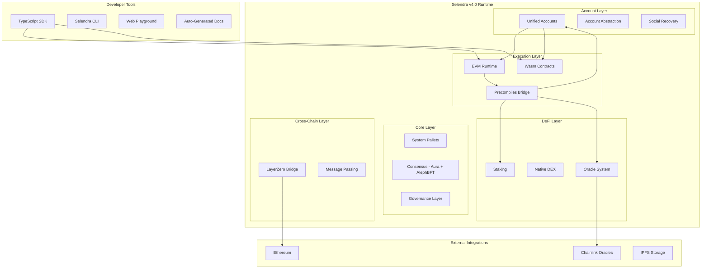

# Design Document

## Overview

Selendra v4.0 represents a major architectural evolution that transforms the platform from a functional blockchain into a production-ready, developer-centric ecosystem. The design focuses on three core pillars: **Security First**, **Developer Experience**, and **DeFi-Ready Infrastructure**.

The upgrade maintains backward compatibility while introducing significant improvements in governance, security, developer tooling, and cross-chain capabilities. The architecture leverages Selendra's unique unified account system and native EVM integration to provide capabilities not available on other platforms.

## Architecture

### High-Level System Architecture



### Security Architecture

The security model is built on multiple layers of protection:

1. **Runtime Security**: All pallets use bounded storage, secure randomness, and proper access controls
2. **Governance Security**: Multi-signature council with time-delayed execution for critical operations
3. **Bridge Security**: Multi-party computation with emergency pause mechanisms
4. **Contract Security**: Filtered runtime calls and gas-optimized precompiles

### Consensus and Finality

- **Block Production**: Aura (Authority Round) with 1-second slots
- **Finality**: AlephBFT for Byzantine fault tolerance
- **Validator Management**: DPoS through elections pallet with committee management
- **Performance Target**: 1000+ TPS for simple operations, 50M gas per block for EVM

## Components and Interfaces

### 1. Security Layer Components

#### Secure Randomness System
```rust
// New pallet-randomness integration
pub struct RandomnessConfig {
    pub vrf_threshold: u32,
    pub vdf_difficulty: u32,
    pub request_delay: BlockNumber,
    pub max_requests_per_block: u32,
}

// Interface for contracts
trait SecureRandomness {
    fn request_randomness(seed: H256) -> RequestId;
    fn fulfill_randomness(request_id: RequestId) -> Option<H256>;
    fn get_randomness_status(request_id: RequestId) -> RandomnessStatus;
}
```

#### Bounded Storage Migration
```rust
// Migration strategy for existing pallets
pub struct StorageMigration<T: Config> {
    pub max_items: u32,
    pub migration_batch_size: u32,
}

// All storage items follow this pattern
#[pallet::storage]
pub type BoundedStorage<T: Config> = StorageMap<
    _,
    Blake2_128Concat,
    KeyType,
    BoundedVec<ValueType, MaxItems>,
    ValueQuery,
>;
```

### 2. Governance Layer Components

#### Council System
```rust
pub struct CouncilConfig {
    pub member_count: u32,           // 7 members
    pub motion_duration: BlockNumber, // 7 days
    pub voting_threshold: Perbill,   // 51% for normal, 67% for critical
}

// Council powers
enum CouncilAction {
    TreasurySpend(Balance),
    RuntimeUpgrade(Vec<u8>),
    EmergencyPause,
    ValidatorManagement,
}
```

#### Democracy Integration
```rust
pub struct DemocracyConfig {
    pub launch_period: BlockNumber,    // 7 days
    pub voting_period: BlockNumber,    // 14 days
    pub enactment_delay: BlockNumber,  // 2 days
    pub minimum_deposit: Balance,      // 100 SEL
}
```

### 3. EVM Precompile System

#### Precompile Architecture
```rust
// Unified precompile dispatcher
pub struct PrecompileSet<Runtime> {
    pub staking: StakingPrecompile<Runtime>,
    pub governance: GovernancePrecompile<Runtime>,
    pub unified_accounts: UnifiedAccountsPrecompile<Runtime>,
    pub oracle: OraclePrecompile<Runtime>,
    pub account_abstraction: AccountAbstractionPrecompile<Runtime>,
}

// Address mapping
const PRECOMPILE_ADDRESSES: &[(H160, &str)] = &[
    (H160::from_low_u64_be(0x0402), "Oracle"),
    (H160::from_low_u64_be(0x0403), "Staking"),
    (H160::from_low_u64_be(0x0404), "Governance"),
    (H160::from_low_u64_be(0x0405), "UnifiedAccounts"),
    (H160::from_low_u64_be(0x0406), "AccountAbstraction"),
];
```

#### Staking Precompile Interface
```solidity
interface IStaking {
    function stake(address validator, uint256 amount) external;
    function unstake(uint256 amount) external;
    function claimRewards() external;
    function getStakedAmount(address staker) external view returns (uint256);
    function getValidators() external view returns (address[] memory);
    function getRewards(address staker) external view returns (uint256);
}
```

### 4. Developer Experience Components

#### TypeScript SDK Architecture
```typescript
// Core SDK structure
export class SelendraSDK {
    public api: ApiManager;
    public accounts: AccountManager;
    public contracts: ContractManager;
    public transactions: TransactionBuilder;
    public unified: UnifiedAccountsManager;
    public defi: DeFiManager;
    
    constructor(config: SDKConfig) {
        // Initialize all managers
    }
}

// Account management with unified accounts
export class AccountManager {
    async createAccount(type: 'native' | 'evm'): Promise<Account>;
    async linkAccounts(native: Account, evm: Account): Promise<void>;
    async getBalance(account: Account): Promise<Balance>;
    async transfer(from: Account, to: Account, amount: Balance): Promise<TxHash>;
}
```

#### CLI Tool Design
```bash
# Command structure
selendra <command> [options]

# Core commands
selendra init <template>          # Initialize project
selendra deploy [contract]        # Deploy contracts
selendra verify <address>         # Verify contracts
selendra test                     # Run tests
selendra node                     # Local development node
selendra faucet <address>         # Get testnet tokens
selendra watch <address>          # Monitor transactions
```

#### Web Playground Architecture
```typescript
// Playground components
interface PlaygroundState {
    editor: MonacoEditor;
    compiler: SolidityCompiler;
    deployer: ContractDeployer;
    interactor: ContractInteractor;
    console: DebugConsole;
}

// Real-time compilation and deployment
class PlaygroundEngine {
    async compile(source: string): Promise<CompilationResult>;
    async deploy(bytecode: string, abi: ABI): Promise<ContractInstance>;
    async interact(contract: ContractInstance, method: string, args: any[]): Promise<TxResult>;
}
```

### 5. DeFi Infrastructure Components

#### Oracle System Design
```rust
// Chainlink integration pallet
pub struct OracleConfig {
    pub max_oracles_per_feed: u32,
    pub min_responses_required: u32,
    pub price_deviation_threshold: Perbill,
    pub heartbeat_interval: BlockNumber,
}

// Price feed management
#[pallet::storage]
pub type PriceFeeds<T: Config> = StorageMap<
    _,
    Blake2_128Concat,
    AssetId,
    PriceFeedData<T::BlockNumber>,
    OptionQuery,
>;

pub struct PriceFeedData<BlockNumber> {
    pub price: u128,
    pub timestamp: BlockNumber,
    pub round_id: u64,
    pub oracle_responses: BoundedVec<OracleResponse, MaxOracles>,
}
```

#### Native DEX Architecture
```rust
// AMM implementation
pub struct PoolConfig {
    pub minimum_liquidity: Balance,
    pub trading_fee: Perbill,        // 0.3%
    pub protocol_fee: Perbill,       // 0.05%
}

// Pool management
#[pallet::storage]
pub type LiquidityPools<T: Config> = StorageMap<
    _,
    Blake2_128Concat,
    (AssetId, AssetId),
    PoolInfo<T::AccountId, T::Balance>,
    OptionQuery,
>;

// Constant product formula: x * y = k
impl<T: Config> Pallet<T> {
    fn calculate_swap_output(
        amount_in: Balance,
        reserve_in: Balance,
        reserve_out: Balance,
    ) -> Result<Balance, DispatchError>;
}
```

### 6. Cross-Chain Integration

#### LayerZero Bridge Design
```solidity
// Selendra LayerZero endpoint
contract SelendraEndpoint is NonblockingLzApp {
    struct BridgeConfig {
        uint256 minAmount;
        uint256 maxAmount;
        uint256 dailyLimit;
        uint256 fee;
        bool paused;
    }
    
    mapping(uint16 => BridgeConfig) public chainConfigs;
    mapping(address => uint256) public dailyVolume;
    
    function bridgeTokens(
        uint16 dstChainId,
        bytes memory toAddress,
        uint256 amount
    ) external payable;
    
    function estimateFee(
        uint16 dstChainId,
        uint256 amount
    ) external view returns (uint256);
}
```

#### Multi-Signature Security
```rust
// Bridge security council
pub struct BridgeCouncil<T: Config> {
    pub members: BoundedVec<T::AccountId, MaxMembers>,
    pub threshold: u32,
    pub timelock_delay: T::BlockNumber,
}

// Emergency controls
enum EmergencyAction {
    PauseBridge,
    UpdateLimits(Balance),
    RecoverFunds(T::AccountId, Balance),
}
```

## Data Models

### Account System Data Model
```rust
// Unified account mapping
pub struct AccountMapping {
    pub native_account: AccountId32,
    pub evm_account: H160,
    pub linked_at: BlockNumber,
    pub permissions: AccountPermissions,
}

// Account abstraction features
pub struct AccountAbstraction {
    pub recovery_config: Option<RecoveryConfig>,
    pub session_keys: BoundedVec<SessionKey, MaxSessionKeys>,
    pub spending_limits: SpendingLimits,
}

pub struct RecoveryConfig {
    pub guardians: BoundedVec<AccountId32, MaxGuardians>,
    pub threshold: u32,
    pub delay_period: BlockNumber,
}
```

### DeFi Data Models
```rust
// Oracle price data
pub struct PriceData {
    pub asset_id: AssetId,
    pub price: u128,              // Price in USD with 18 decimals
    pub confidence: u128,         // Confidence interval
    pub timestamp: BlockNumber,
    pub round_id: u64,
}

// DEX pool data
pub struct PoolInfo {
    pub asset_a: AssetId,
    pub asset_b: AssetId,
    pub reserve_a: Balance,
    pub reserve_b: Balance,
    pub total_supply: Balance,
    pub lp_token_id: AssetId,
    pub fee_rate: Perbill,
}
```

### Governance Data Models
```rust
// Council proposal
pub struct CouncilProposal {
    pub proposer: AccountId32,
    pub call: Box<RuntimeCall>,
    pub votes_for: BoundedVec<AccountId32, MaxMembers>,
    pub votes_against: BoundedVec<AccountId32, MaxMembers>,
    pub created_at: BlockNumber,
    pub voting_deadline: BlockNumber,
}

// Democracy referendum
pub struct Referendum {
    pub proposal_hash: H256,
    pub threshold: VoteThreshold,
    pub delay: BlockNumber,
    pub votes: ReferendumVotes,
    pub status: ReferendumStatus,
}
```

## Error Handling

### Comprehensive Error System
```rust
// Unified error types
#[derive(Encode, Decode, Clone, PartialEq, Eq, RuntimeDebug, TypeInfo)]
pub enum SelendraError {
    // Security errors
    InsufficientPermissions,
    InvalidRandomnessRequest,
    StorageLimitExceeded,
    
    // Account errors
    AccountNotLinked,
    InvalidRecoveryAttempt,
    SessionKeyExpired,
    
    // DeFi errors
    InsufficientLiquidity,
    SlippageExceeded,
    OraclePriceStale,
    
    // Bridge errors
    BridgePaused,
    DailyLimitExceeded,
    InvalidDestinationChain,
}

// Error context for debugging
pub struct ErrorContext {
    pub error_code: u32,
    pub message: String,
    pub suggested_fixes: Vec<String>,
    pub documentation_links: Vec<String>,
}
```

### Developer-Friendly Error Messages
```typescript
// SDK error handling
export class SelendraSDKError extends Error {
    constructor(
        public code: string,
        message: string,
        public context: ErrorContext,
        public fixes: string[],
        public links: Record<string, string>
    ) {
        super(message);
    }
    
    toUserFriendlyString(): string {
        return `
❌ ${this.message}

💡 How to fix:
${this.fixes.map((fix, i) => `${i + 1}. ${fix}`).join('\n')}

📚 Learn more:
${Object.entries(this.links).map(([name, url]) => `${name}: ${url}`).join('\n')}
        `;
    }
}
```

## Testing Strategy

### Multi-Layer Testing Approach

#### 1. Unit Testing
```rust
// Pallet-level unit tests
#[cfg(test)]
mod tests {
    use super::*;
    use frame_support::{assert_ok, assert_noop, traits::Get};
    
    #[test]
    fn test_secure_randomness_request() {
        ExtBuilder::default().build().execute_with(|| {
            // Test randomness request and fulfillment
            let request_id = Randomness::request_randomness(H256::random());
            assert!(RandomnessRequests::<Test>::contains_key(request_id));
        });
    }
    
    #[test]
    fn test_bounded_storage_limits() {
        ExtBuilder::default().build().execute_with(|| {
            // Test storage bounds are enforced
            let max_items = <Test as Config>::MaxItems::get();
            // Attempt to exceed limit should fail
        });
    }
}
```

#### 2. Integration Testing
```rust
// Cross-pallet integration tests
#[test]
fn test_unified_accounts_with_staking() {
    ExtBuilder::default().build().execute_with(|| {
        // Link native and EVM accounts
        let native_account = AccountId32::from([1u8; 32]);
        let evm_account = H160::from_low_u64_be(1);
        
        assert_ok!(UnifiedAccounts::link_account(native_account, evm_account));
        
        // Stake through EVM precompile
        let staking_precompile = H160::from_low_u64_be(0x0403);
        let result = EVM::call(
            evm_account,
            staking_precompile,
            encode_stake_call(validator, amount),
            gas_limit,
        );
        
        assert_ok!(result);
        
        // Verify staking state
        assert_eq!(Staking::ledger(&native_account).unwrap().active, amount);
    });
}
```

#### 3. End-to-End Testing
```typescript
// SDK integration tests
describe('Selendra SDK E2E Tests', () => {
    let sdk: SelendraSDK;
    
    beforeEach(async () => {
        sdk = new SelendraSDK({
            endpoint: 'ws://localhost:9944',
            network: 'development'
        });
        await sdk.connect();
    });
    
    it('should deploy and interact with contract', async () => {
        // Deploy contract
        const contract = await sdk.contracts.deploy({
            source: tokenSource,
            constructor: 'Token',
            args: ['TestToken', 'TEST', 1000000]
        });
        
        // Interact with contract
        const balance = await contract.call('balanceOf', [account.address]);
        expect(balance).toBe('1000000');
        
        // Transfer tokens
        const tx = await contract.send('transfer', [recipient, 1000]);
        await tx.wait();
        
        // Verify transfer
        const newBalance = await contract.call('balanceOf', [recipient]);
        expect(newBalance).toBe('1000');
    });
});
```

#### 4. Performance Testing
```rust
// Benchmarking for weight calculations
#[benchmarks]
mod benchmarks {
    use super::*;
    
    #[benchmark]
    fn stake_through_precompile() {
        let caller = account("caller", 0, 0);
        let validator = account("validator", 1, 0);
        let amount = 1000u32.into();
        
        #[extrinsic_call]
        stake_via_evm(caller, validator, amount);
        
        // Verify staking occurred
        assert!(Staking::ledger(&caller).is_some());
    }
    
    #[benchmark]
    fn oracle_price_update() {
        let oracle = account("oracle", 0, 0);
        let asset_id = 1u32;
        let price = 50000u128; // $500.00
        
        #[extrinsic_call]
        submit_price(oracle, asset_id, price);
        
        // Verify price updated
        assert_eq!(Oracle::get_price(asset_id), Some(price));
    }
}
```

## Security Considerations

### 1. Runtime Security
- All storage items bounded to prevent state bloat attacks
- Secure randomness using VRF+VDF to prevent manipulation
- Filtered runtime calls from contracts to prevent privilege escalation
- Weight-based fee system to prevent DoS attacks

### 2. Governance Security
- Multi-signature council with time delays for critical operations
- Democratic oversight through referendum system
- Emergency pause mechanisms for critical vulnerabilities
- Transparent proposal and voting processes

### 3. Bridge Security
- Multi-party computation for cross-chain operations
- Daily limits and monitoring for large transfers
- Emergency pause and recovery mechanisms
- Comprehensive audit trail for all bridge operations

### 4. Contract Security
- Gas limits and metering to prevent infinite loops
- Precompile access controls to prevent unauthorized operations
- Comprehensive testing of all precompile functions
- Regular security audits of critical components

This design provides a comprehensive foundation for implementing Selendra v4.0 with all the required security, functionality, and developer experience improvements while maintaining the platform's unique advantages in unified accounts and native-EVM integration.