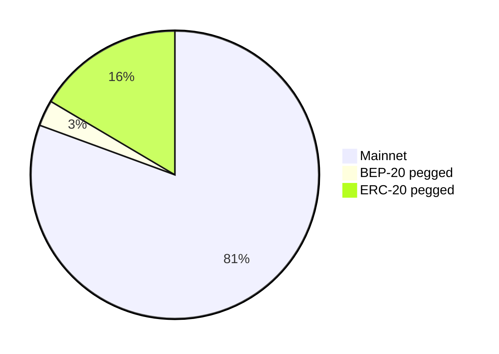
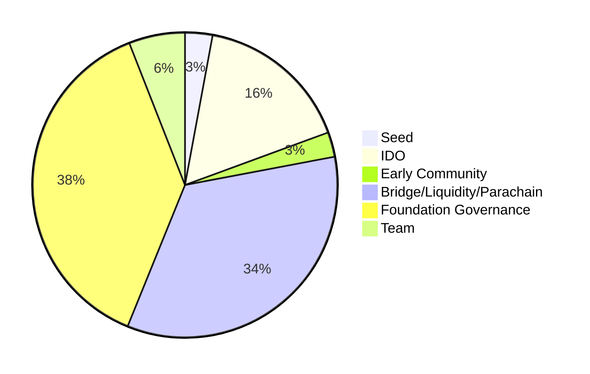

# Tokenomics 

Issued on three networks; 
| Platform                     | SEL                         |
| ------------------------| ----------------------------|  
| Mainnet	              | 425,233,741                 | 
| ERC-20 pegged           | 87,035,376                  | 
| BEP-20 pegged           | 15,357,667                  | 
| **Total supply**        | **527,626,784**             | 
| **Max supply*****       | **3,141,592,654**           | 



```
1 SEL = 1.000,000,000,000 Loka (One thousand billion or Plank 10^12)
1 Loka = 0.000,000,000,001 SEL 
```
## Allocation 

```
- BEP-20	                15,357,667
- ERC-20	                87,035,376
- Existing users	        19,113,163
- Bridge Liquidity	        180,000,000	
- Foundation Governance	    200,000,000
- Teams	                    31,415,927
```


## Inflation		

```
- max:	    10,763,227	2.50%
- average:	4,305,291	1.00%
- min:	    2,152,645	0.50%
```

## Token supply

All fees charged on Selendra are burned. New SEL token is generated via inflation then distribute in a form of reward to validators and stakers for helping to secure and navigate the network. Inflation is set to be between 0.5% - 2.5% per year, with initial supply of 527,626,784 SEL. Max supply set to be 3,141,592,654 SEL.  


This way SEL token's max supply will never ever reach in this century, leaving enough time for the next generation of users, builders, and governance to decide what they want to do with the max supply.  

SEL to company stocks
```
- Yield = Dividend  
- Burn  = Buy back
- Earn  = Fees generated
```